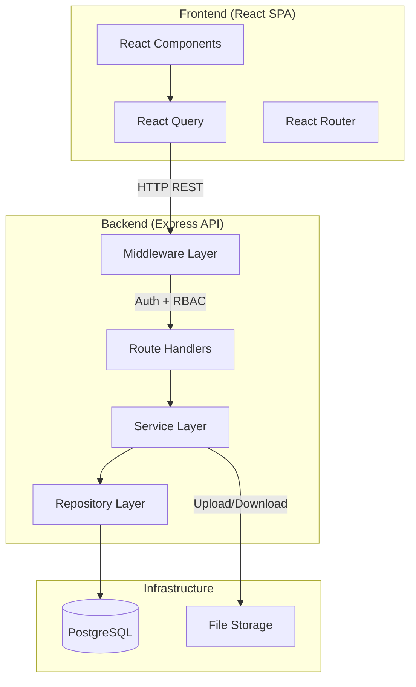
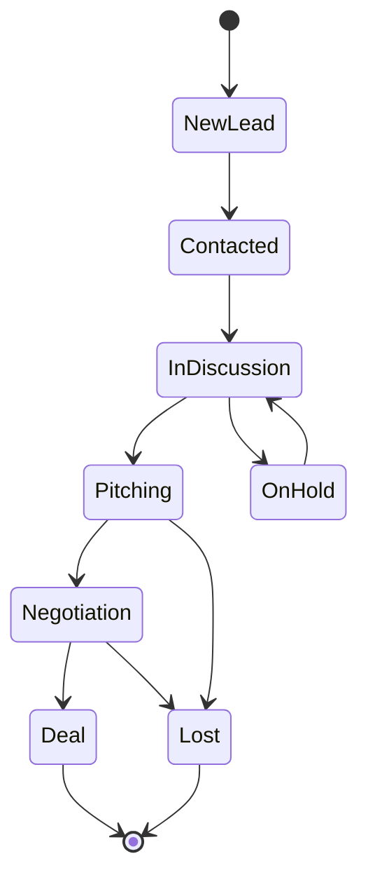
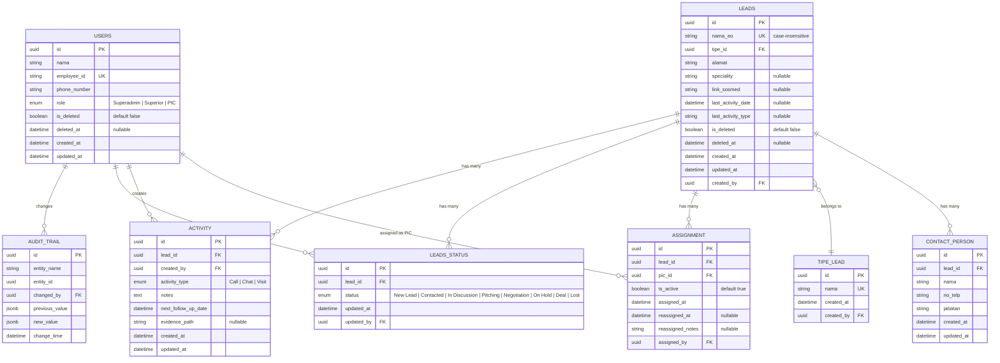

# Dokumen Design — SCO Lead Management

## Overview

SCO Lead Management adalah aplikasi internal full-stack untuk mengelola data EO/Mitra (Lead), assignment PIC, tracking status pipeline, dan dokumentasi aktivitas follow-up. Sistem ini menggantikan proses manual yang belum terpusat dengan solusi digital terstruktur.

### Keputusan Arsitektur Utama

| Keputusan | Pilihan | Alasan |
|---|---|---|
| Backend Framework | Node.js + Express | Ringan, ekosistem luas, cocok untuk REST API |
| Database | PostgreSQL | Relational, mendukung constraint kompleks, audit trail, dan soft delete |
| ORM | Prisma | Type-safe, migrasi otomatis, cocok dengan TypeScript |
| Frontend Framework | React + TypeScript | Komponen reusable, type safety, ekosistem UI matang |
| State Management | React Query (TanStack Query) | Server-state caching, auto-refetch, optimistic updates |
| File Storage | Local disk (volume mount) | Sederhana untuk fase awal, bisa migrasi ke S3 nanti |
| Authentication | JWT (access + refresh token) | Stateless, cocok untuk SPA |
| Validation | Zod (backend + frontend) | Schema validation yang bisa di-share |
| Testing | Vitest + fast-check | Unit/integration test + property-based testing |

## Architecture

### High-Level Architecture



### Backend Layer Architecture

```mermaid
graph LR
    subgraph Middleware
        AuthMW[Auth Middleware]
        RBAC[RBAC Middleware]
        Validate[Validation Middleware]
        Upload[Multer Upload]
    end

    subgraph Routes
        LeadR[Lead Routes]
        ContactR[Contact Person Routes]
        UserR[User Routes]
        AssignR[Assignment Routes]
        StatusR[Status Routes]
        ActivityR[Activity Routes]
        TypeR[Tipe Lead Routes]
        AuditR[Audit Trail Routes]
    end

    subgraph Services
        LeadS[Lead Service]
        ContactS[Contact Person Service]
        UserS[User Service]
        AssignS[Assignment Service]
        StatusS[Status Service]
        ActivityS[Activity Service]
        TypeS[Tipe Lead Service]
        AuditS[Audit Trail Service]
    end

    subgraph Repositories
        LeadRepo[Lead Repo]
        ContactRepo[Contact Repo]
        UserRepo[User Repo]
        AssignRepo[Assignment Repo]
        StatusRepo[Status Repo]
        ActivityRepo[Activity Repo]
        TypeRepo[Tipe Lead Repo]
        AuditRepo[Audit Trail Repo]
    end

    Middleware --> Routes
    Routes --> Services
    Services --> Repositories
```



### Status Pipeline State Machine



## Components and Interfaces

### Backend API Endpoints

#### Lead Management
| Method | Endpoint | Role | Deskripsi |
|--------|----------|------|-----------|
| POST | `/api/leads` | Superadmin, Superior, PIC | Buat Lead baru |
| GET | `/api/leads` | All (filtered by role) | Daftar Lead dengan filter & search |
| GET | `/api/leads/:id` | All (filtered by role) | Detail Lead |
| PUT | `/api/leads/:id` | Superadmin, Superior | Update data Lead |
| DELETE | `/api/leads/:id` | Superadmin | Soft delete Lead |

#### Contact Person
| Method | Endpoint | Role | Deskripsi |
|--------|----------|------|-----------|
| POST | `/api/leads/:leadId/contacts` | Superadmin, Superior, PIC | Tambah Contact Person |
| GET | `/api/leads/:leadId/contacts` | All (filtered by role) | Daftar Contact Person |
| PUT | `/api/leads/:leadId/contacts/:id` | Superadmin, Superior, PIC | Update Contact Person |

#### User Management
| Method | Endpoint | Role | Deskripsi |
|--------|----------|------|-----------|
| POST | `/api/users` | Superadmin | Buat user baru |
| GET | `/api/users` | Superadmin | Daftar user |
| GET | `/api/users/:id` | Superadmin | Detail user |
| PUT | `/api/users/:id` | Superadmin | Update user |
| DELETE | `/api/users/:id` | Superadmin | Soft delete user |

#### Tipe Lead
| Method | Endpoint | Role | Deskripsi |
|--------|----------|------|-----------|
| POST | `/api/lead-types` | Superadmin, Superior | Tambah Tipe Lead |
| GET | `/api/lead-types` | All | Daftar Tipe Lead |

#### Assignment
| Method | Endpoint | Role | Deskripsi |
|--------|----------|------|-----------|
| POST | `/api/leads/:leadId/assignments` | Superior | Assign Lead ke PIC |
| GET | `/api/leads/:leadId/assignments` | Superadmin, Superior | Histori assignment |

#### Status Pipeline
| Method | Endpoint | Role | Deskripsi |
|--------|----------|------|-----------|
| POST | `/api/leads/:leadId/status` | Superadmin, Superior, PIC | Update status Lead |
| GET | `/api/leads/:leadId/status` | All (filtered by role) | Histori status Lead |

#### Activity Log
| Method | Endpoint | Role | Deskripsi |
|--------|----------|------|-----------|
| POST | `/api/leads/:leadId/activities` | PIC | Buat Activity baru |
| GET | `/api/leads/:leadId/activities` | All (filtered by role) | Daftar Activity |
| PUT | `/api/leads/:leadId/activities/:id` | PIC (owner only) | Update Activity |

#### Evidence Upload
| Method | Endpoint | Role | Deskripsi |
|--------|----------|------|-----------|
| POST | `/api/leads/:leadId/activities/:activityId/evidence` | PIC | Upload evidence |
| GET | `/api/evidence/:filename` | All (filtered by role) | Download/view evidence |

#### Audit Trail
| Method | Endpoint | Role | Deskripsi |
|--------|----------|------|-----------|
| GET | `/api/leads/:leadId/audit-trail` | Superadmin, Superior | Audit trail per Lead |

### Middleware Stack

```
Request → CORS → Body Parser → Auth (JWT verify) → RBAC (role check) → Validation (Zod) → Route Handler → Response
```

#### Auth Middleware
- Verifikasi JWT token dari header `Authorization: Bearer <token>`
- Decode payload: `{ userId, role, employeeId }`
- Attach `req.user` untuk digunakan di handler berikutnya

#### RBAC Middleware
- Factory function: `authorize(...allowedRoles: Role[])`
- Cek `req.user.role` terhadap daftar role yang diizinkan
- Return 403 jika role tidak sesuai

#### Lead Ownership Middleware
- Untuk role PIC: verifikasi bahwa Lead di-assign ke PIC yang sedang login
- Query assignment aktif (`is_active = true`) untuk Lead tersebut
- Return 403 jika PIC bukan assignee aktif

#### Validation Middleware
- Gunakan Zod schema untuk validasi `req.body`, `req.params`, `req.query`
- Return 400 dengan detail error jika validasi gagal

### Service Layer Interfaces

```typescript
// Lead Service
interface LeadService {
  create(data: CreateLeadDTO, userId: string): Promise<Lead>;
  findAll(filters: LeadFilters, user: AuthUser): Promise<PaginatedResult<Lead>>;
  findById(id: string, user: AuthUser): Promise<Lead>;
  update(id: string, data: UpdateLeadDTO, userId: string): Promise<Lead>;
  softDelete(id: string, userId: string): Promise<void>;
}

// Assignment Service
interface AssignmentService {
  assign(leadId: string, picId: string, userId: string): Promise<Assignment>;
  reassign(leadId: string, newPicId: string, notes: string, userId: string): Promise<Assignment>;
  getHistory(leadId: string): Promise<Assignment[]>;
  getActiveAssignment(leadId: string): Promise<Assignment | null>;
}

// Status Pipeline Service
interface StatusPipelineService {
  updateStatus(leadId: string, newStatus: PipelineStatus, userId: string): Promise<LeadStatus>;
  getHistory(leadId: string): Promise<LeadStatus[]>;
  validateTransition(currentStatus: PipelineStatus, newStatus: PipelineStatus): boolean;
}

// Activity Service
interface ActivityService {
  create(leadId: string, data: CreateActivityDTO, userId: string): Promise<Activity>;
  findByLead(leadId: string): Promise<Activity[]>;
  update(id: string, data: UpdateActivityDTO, userId: string): Promise<Activity>;
}

// Audit Trail Service
interface AuditTrailService {
  log(entry: CreateAuditEntry): Promise<AuditTrail>;
  getByEntity(entityName: string, entityId: string): Promise<AuditTrail[]>;
  getByLead(leadId: string): Promise<AuditTrail[]>;
}
```

### Frontend Component Structure

```
src/
├── components/
│   ├── layout/          # Sidebar, Header, MainLayout
│   ├── leads/           # LeadTable, LeadForm, LeadDetail, LeadFilters
│   ├── contacts/        # ContactList, ContactForm
│   ├── activities/      # ActivityList, ActivityForm, EvidenceUpload
│   ├── assignments/     # AssignmentForm, AssignmentHistory
│   ├── pipeline/        # PipelineBoard, StatusBadge, StatusTransition
│   ├── users/           # UserTable, UserForm
│   ├── audit/           # AuditTrailTable
│   └── shared/          # Button, Modal, Input, Select, FileUpload, Pagination
├── hooks/               # useLeads, useActivities, useAuth, etc.
├── services/            # API client functions
├── types/               # TypeScript interfaces
├── utils/               # Helpers, constants, validators
└── pages/               # LeadsPage, LeadDetailPage, UsersPage, etc.
```

## Data Models

### Entity Relationship Diagram



### Prisma Schema (Key Models)

```prisma
enum Role {
  SUPERADMIN
  SUPERIOR
  PIC
}

enum PipelineStatus {
  NEW_LEAD
  CONTACTED
  IN_DISCUSSION
  PITCHING
  NEGOTIATION
  ON_HOLD
  DEAL
  LOST
}

enum ActivityType {
  CALL
  CHAT
  VISIT
}

model User {
  id          String    @id @default(uuid())
  nama        String
  employeeId  String    @unique @map("employee_id")
  phoneNumber String    @map("phone_number")
  role        Role
  isDeleted   Boolean   @default(false) @map("is_deleted")
  deletedAt   DateTime? @map("deleted_at")
  createdAt   DateTime  @default(now()) @map("created_at")
  updatedAt   DateTime  @updatedAt @map("updated_at")

  assignments  Assignment[]
  activities   Activity[]
  leadStatuses LeadStatus[]
  auditTrails  AuditTrail[]
  createdLeads Lead[]       @relation("CreatedBy")

  @@map("users")
}

model Lead {
  id               String    @id @default(uuid())
  namaEo           String    @map("nama_eo")
  tipeId           String    @map("tipe_id")
  alamat           String
  speciality       String?
  linkSosmed       String?   @map("link_sosmed")
  lastActivityDate DateTime? @map("last_activity_date")
  lastActivityType String?   @map("last_activity_type")
  isDeleted        Boolean   @default(false) @map("is_deleted")
  deletedAt        DateTime? @map("deleted_at")
  createdAt        DateTime  @default(now()) @map("created_at")
  updatedAt        DateTime  @updatedAt @map("updated_at")
  createdBy        String    @map("created_by")

  tipe          TipeLead       @relation(fields: [tipeId], references: [id])
  creator       User           @relation("CreatedBy", fields: [createdBy], references: [id])
  contacts      ContactPerson[]
  assignments   Assignment[]
  statuses      LeadStatus[]
  activities    Activity[]

  @@unique([namaEo], map: "leads_nama_eo_unique")
  @@map("leads")
}

model TipeLead {
  id        String   @id @default(uuid())
  nama      String   @unique
  createdAt DateTime @default(now()) @map("created_at")
  createdBy String   @map("created_by")

  leads Lead[]

  @@map("tipe_lead")
}

model ContactPerson {
  id        String   @id @default(uuid())
  leadId    String   @map("lead_id")
  nama      String
  noTelp    String   @map("no_telp")
  jabatan   String
  createdAt DateTime @default(now()) @map("created_at")
  updatedAt DateTime @updatedAt @map("updated_at")

  lead Lead @relation(fields: [leadId], references: [id])

  @@map("contact_person")
}

model Assignment {
  id              String    @id @default(uuid())
  leadId          String    @map("lead_id")
  picId           String    @map("pic_id")
  isActive        Boolean   @default(true) @map("is_active")
  assignedAt      DateTime  @default(now()) @map("assigned_at")
  reassignedAt    DateTime? @map("reassigned_at")
  reassignedNotes String?   @map("reassigned_notes")
  assignedBy      String    @map("assigned_by")

  lead Lead @relation(fields: [leadId], references: [id])
  pic  User @relation(fields: [picId], references: [id])

  @@map("assignment")
}

model LeadStatus {
  id        String         @id @default(uuid())
  leadId    String         @map("lead_id")
  status    PipelineStatus
  updatedAt DateTime       @default(now()) @map("updated_at")
  updatedBy String         @map("updated_by")

  lead    Lead @relation(fields: [leadId], references: [id])
  updater User @relation(fields: [updatedBy], references: [id])

  @@map("leads_status")
}

model Activity {
  id               String       @id @default(uuid())
  leadId           String       @map("lead_id")
  createdBy        String       @map("created_by")
  activityType     ActivityType @map("activity_type")
  notes            String
  nextFollowUpDate DateTime     @map("next_follow_up_date")
  evidencePath     String?      @map("evidence_path")
  createdAt        DateTime     @default(now()) @map("created_at")
  updatedAt        DateTime     @updatedAt @map("updated_at")

  lead    Lead @relation(fields: [leadId], references: [id])
  creator User @relation(fields: [createdBy], references: [id])

  @@map("activity")
}

model AuditTrail {
  id            String   @id @default(uuid())
  entityName    String   @map("entity_name")
  entityId      String   @map("entity_id")
  changedBy     String   @map("changed_by")
  previousValue Json?    @map("previous_value")
  newValue      Json?    @map("new_value")
  changeTime    DateTime @default(now()) @map("change_time")

  changer User @relation(fields: [changedBy], references: [id])

  @@index([entityName, entityId])
  @@map("audit_trail")
}
```

### Validation Schemas (Zod)

```typescript
// Lead validation
const createLeadSchema = z.object({
  nama_eo: z.string().min(1).max(255).trim(),
  tipe_id: z.string().uuid(),
  alamat: z.string().min(1).max(500).trim(),
  speciality: z.string().max(255).optional(),
  link_sosmed: z.string().url().optional().or(z.literal("")),
});

// Contact Person validation
const createContactSchema = z.object({
  nama: z.string().min(1).max(255).trim(),
  no_telp: z.string().min(1).max(20).trim(),
  jabatan: z.string().min(1).max(100).trim(),
});

// Activity validation
const createActivitySchema = z.object({
  activity_type: z.enum(["CALL", "CHAT", "VISIT"]),
  notes: z.string().min(1).trim(),
  next_follow_up_date: z.string().datetime(),
});

// Status update validation
const updateStatusSchema = z.object({
  status: z.enum([
    "NEW_LEAD", "CONTACTED", "IN_DISCUSSION", "PITCHING",
    "NEGOTIATION", "ON_HOLD", "DEAL", "LOST"
  ]),
});

// User validation
const createUserSchema = z.object({
  nama: z.string().min(1).max(255).trim(),
  employee_id: z.string().min(1).max(50).trim(),
  phone_number: z.string().min(1).max(20).trim(),
  role: z.enum(["SUPERADMIN", "SUPERIOR", "PIC"]),
});

// File upload validation
const evidenceFileSchema = z.object({
  mimetype: z.enum(["image/jpeg", "image/png"]),
  size: z.number().max(5 * 1024 * 1024), // 5MB
});

// Lead filter query validation
const leadFilterSchema = z.object({
  status: z.enum([...pipelineStatuses]).optional(),
  pic_id: z.string().uuid().optional(),
  tipe_id: z.string().uuid().optional(),
  last_activity_from: z.string().datetime().optional(),
  last_activity_to: z.string().datetime().optional(),
  search: z.string().optional(),
  page: z.coerce.number().int().positive().default(1),
  limit: z.coerce.number().int().positive().max(100).default(20),
});
```

### Status Transition Map

```typescript
const STATUS_TRANSITIONS: Record<PipelineStatus, PipelineStatus[]> = {
  NEW_LEAD: ["CONTACTED"],
  CONTACTED: ["IN_DISCUSSION"],
  IN_DISCUSSION: ["PITCHING", "ON_HOLD"],
  PITCHING: ["NEGOTIATION", "LOST"],
  NEGOTIATION: ["DEAL", "LOST"],
  ON_HOLD: ["IN_DISCUSSION"],
  DEAL: [],
  LOST: [],
};

function validateTransition(current: PipelineStatus, next: PipelineStatus): boolean {
  return STATUS_TRANSITIONS[current]?.includes(next) ?? false;
}
```

## Correctness Properties

*A property is a characteristic or behavior that should hold true across all valid executions of a system — essentially, a formal statement about what the system should do. Properties serve as the bridge between human-readable specifications and machine-verifiable correctness guarantees.*

### Property 1: Lead baru selalu berstatus New Lead

*For any* data Lead yang valid, ketika Lead dibuat, status awalnya harus selalu "NEW_LEAD" dan field `created_at` harus terisi secara otomatis.

**Validates: Requirements 1.1**

### Property 2: Uniqueness nama_eo bersifat case-insensitive dan trimmed

*For any* string `nama_eo`, jika sudah ada Lead dengan nama tersebut, maka pembuatan atau pembaruan Lead dengan variasi case (upper, lower, mixed) atau whitespace padding dari nama yang sama harus selalu ditolak.

**Validates: Requirements 1.3**

### Property 3: Soft delete mengubah is_deleted dan mencatat deleted_at

*For any* entitas yang mendukung soft delete (Lead atau User), setelah operasi soft delete, field `is_deleted` harus bernilai `true`, `deleted_at` harus terisi, dan data asli tetap ada di database.

**Validates: Requirements 1.4, 3.3**

### Property 4: Setiap mutasi pada entitas yang dilacak menghasilkan Audit Trail

*For any* operasi perubahan (create, update, soft delete) pada entitas Lead, Contact Person, Assignment, Status, atau Activity, sistem harus mencatat record Audit Trail dengan `entity_name`, `entity_id`, `changed_by`, `previous_value`, `new_value`, dan `change_time` yang valid.

**Validates: Requirements 1.5, 2.3, 6.4, 10.1**

### Property 5: PIC hanya melihat Lead yang di-assign kepadanya

*For any* kumpulan Lead dan PIC tertentu, ketika PIC mengakses daftar Lead, setiap Lead yang dikembalikan harus memiliki assignment aktif ke PIC tersebut, dan tidak ada Lead yang tidak di-assign yang muncul dalam hasil.

**Validates: Requirements 1.6, 11.5**

### Property 6: Transisi status pipeline mengikuti aturan ketat

*For any* pasangan (status_saat_ini, status_tujuan), transisi status harus berhasil jika dan hanya jika pasangan tersebut ada dalam peta transisi yang diizinkan. Transisi yang tidak valid harus ditolak dengan pesan error.

**Validates: Requirements 6.2, 6.3**

### Property 7: Status tidak dapat diperbarui tanpa Activity

*For any* Lead yang belum memiliki Activity, percobaan memperbarui status harus selalu ditolak. Hanya Lead yang sudah memiliki minimal satu Activity yang dapat diperbarui statusnya.

**Validates: Requirements 6.5**

### Property 8: Setiap Lead hanya memiliki satu PIC aktif

*For any* urutan operasi assign dan re-assign pada sebuah Lead, pada setiap titik waktu, jumlah Assignment dengan `is_active = true` untuk Lead tersebut harus selalu tepat satu (atau nol jika belum pernah di-assign).

**Validates: Requirements 5.2**

### Property 9: Re-assign menonaktifkan assignment lama dan membuat assignment baru

*For any* operasi re-assign pada Lead, assignment lama harus memiliki `is_active = false` dan `reassigned_at` terisi, assignment baru harus memiliki `is_active = true`, dan seluruh riwayat Activity dan Status sebelumnya tetap terjaga.

**Validates: Requirements 5.3**

### Property 10: PIC baru tidak dapat mengedit Activity PIC sebelumnya

*For any* Activity yang dibuat oleh PIC sebelumnya, setelah Lead di-reassign ke PIC baru, PIC baru harus ditolak ketika mencoba mengedit Activity tersebut.

**Validates: Requirements 5.4**

### Property 11: Activity memperbarui last_activity pada Lead

*For any* Activity baru yang dibuat untuk sebuah Lead, field `last_activity_date` dan `last_activity_type` pada Lead harus diperbarui sesuai dengan Activity terbaru.

**Validates: Requirements 7.2**

### Property 12: Activity tanpa notes ditolak

*For any* data Activity dengan field `notes` kosong atau hanya berisi whitespace, pembuatan Activity harus selalu ditolak.

**Validates: Requirements 7.3**

### Property 13: Activity Visit tanpa evidence ditolak

*For any* Activity dengan `activity_type = VISIT` yang tidak menyertakan file evidence, pembuatan Activity harus ditolak. Untuk `activity_type = CALL` atau `CHAT`, evidence tidak wajib.

**Validates: Requirements 7.5**

### Property 14: Validasi file evidence (format dan ukuran)

*For any* file yang diunggah sebagai evidence, file diterima jika dan hanya jika formatnya JPG atau PNG dan ukurannya tidak melebihi 5MB. File dengan format lain atau ukuran > 5MB harus ditolak.

**Validates: Requirements 8.1, 8.2**

### Property 15: Filter dan pencarian Lead menggunakan logika AND

*For any* kombinasi filter (Status, PIC, Tipe, Last Activity Date) dan kata kunci pencarian, setiap Lead yang dikembalikan harus memenuhi seluruh kriteria filter yang aktif DAN mengandung kata kunci pencarian pada `nama_eo` (case-insensitive).

**Validates: Requirements 9.1, 9.2, 9.3, 9.4**

### Property 16: Audit Trail bersifat immutable

*For any* record Audit Trail yang sudah tercatat, operasi update atau delete terhadap record tersebut harus selalu ditolak.

**Validates: Requirements 10.2**

### Property 17: RBAC menolak akses di luar hak role

*For any* kombinasi (role, endpoint, method) yang tidak ada dalam matriks izin, sistem harus mengembalikan response error otorisasi (403).

**Validates: Requirements 11.4**

### Property 18: Validasi tipe Lead terhadap master data

*For any* `tipe_id` yang tidak ada di master data Tipe_Lead, pembuatan Lead dengan tipe tersebut harus ditolak.

**Validates: Requirements 4.3**

## Error Handling

### Strategi Error Handling

Sistem menggunakan pendekatan error handling terpusat dengan custom error classes dan global error handler middleware.

### Custom Error Classes

```typescript
class AppError extends Error {
  constructor(
    public statusCode: number,
    public code: string,
    message: string,
    public details?: unknown
  ) {
    super(message);
  }
}

class ValidationError extends AppError {
  constructor(message: string, details?: unknown) {
    super(400, "VALIDATION_ERROR", message, details);
  }
}

class UnauthorizedError extends AppError {
  constructor(message = "Token tidak valid atau tidak ditemukan") {
    super(401, "UNAUTHORIZED", message);
  }
}

class ForbiddenError extends AppError {
  constructor(message = "Anda tidak memiliki akses untuk operasi ini") {
    super(403, "FORBIDDEN", message);
  }
}

class NotFoundError extends AppError {
  constructor(entity: string, id: string) {
    super(404, "NOT_FOUND", `${entity} dengan ID ${id} tidak ditemukan`);
  }
}

class ConflictError extends AppError {
  constructor(message: string) {
    super(409, "CONFLICT", message);
  }
}

class FileTooLargeError extends AppError {
  constructor() {
    super(413, "FILE_TOO_LARGE", "Ukuran file maksimal adalah 5MB");
  }
}

class InvalidFileTypeError extends AppError {
  constructor() {
    super(415, "INVALID_FILE_TYPE", "File harus berformat JPG atau PNG");
  }
}
```

### Error Response Format

```json
{
  "success": false,
  "error": {
    "code": "VALIDATION_ERROR",
    "message": "Deskripsi error yang jelas",
    "details": {}
  }
}
```

### Skenario Error per Domain

| Domain | Skenario | HTTP Code | Error Code |
|--------|----------|-----------|------------|
| Lead | Nama EO duplikat | 409 | CONFLICT |
| Lead | Tipe tidak valid | 400 | VALIDATION_ERROR |
| Lead | Lead tidak ditemukan | 404 | NOT_FOUND |
| Status | Transisi tidak valid | 400 | INVALID_TRANSITION |
| Status | Belum ada Activity | 400 | ACTIVITY_REQUIRED |
| Assignment | PIC tidak ditemukan | 404 | NOT_FOUND |
| Assignment | PIC bukan role PIC | 400 | VALIDATION_ERROR |
| Activity | Notes kosong | 400 | VALIDATION_ERROR |
| Activity | Visit tanpa evidence | 400 | EVIDENCE_REQUIRED |
| Activity | Edit Activity PIC lain | 403 | FORBIDDEN |
| Upload | File > 5MB | 413 | FILE_TOO_LARGE |
| Upload | Format bukan JPG/PNG | 415 | INVALID_FILE_TYPE |
| Auth | Token tidak valid | 401 | UNAUTHORIZED |
| Auth | Role tidak sesuai | 403 | FORBIDDEN |
| Auth | PIC akses Lead lain | 403 | FORBIDDEN |

### Global Error Handler Middleware

```typescript
function errorHandler(err: Error, req: Request, res: Response, next: NextFunction) {
  if (err instanceof AppError) {
    return res.status(err.statusCode).json({
      success: false,
      error: {
        code: err.code,
        message: err.message,
        details: err.details,
      },
    });
  }

  // Zod validation errors
  if (err instanceof ZodError) {
    return res.status(400).json({
      success: false,
      error: {
        code: "VALIDATION_ERROR",
        message: "Data tidak valid",
        details: err.errors,
      },
    });
  }

  // Multer file size error
  if (err.code === "LIMIT_FILE_SIZE") {
    return res.status(413).json({
      success: false,
      error: {
        code: "FILE_TOO_LARGE",
        message: "Ukuran file maksimal adalah 5MB",
      },
    });
  }

  // Unexpected errors
  console.error("Unexpected error:", err);
  return res.status(500).json({
    success: false,
    error: {
      code: "INTERNAL_ERROR",
      message: "Terjadi kesalahan internal",
    },
  });
}
```

## Testing Strategy

### Pendekatan Testing

Sistem menggunakan pendekatan dual testing:
1. **Unit tests** — Verifikasi contoh spesifik, edge case, dan kondisi error
2. **Property-based tests** — Verifikasi properti universal di seluruh input menggunakan `fast-check`

### Library dan Tools

| Tool | Kegunaan |
|------|----------|
| Vitest | Test runner utama |
| fast-check | Property-based testing |
| Supertest | HTTP integration testing |
| Prisma (test client) | Database testing dengan transaction rollback |

### Konfigurasi Property-Based Tests

- Minimum **100 iterasi** per property test
- Setiap property test harus mereferensikan property di design document
- Format tag: `Feature: sco-lead-management, Property {number}: {property_text}`

### Struktur Test

```
tests/
├── backend/
│   ├── unit/
│   │   ├── services/
│   │   │   ├── lead.service.test.ts
│   │   │   ├── assignment.service.test.ts
│   │   │   ├── status-pipeline.service.test.ts
│   │   │   ├── activity.service.test.ts
│   │   │   ├── audit-trail.service.test.ts
│   │   │   └── user.service.test.ts
│   │   ├── middleware/
│   │   │   ├── auth.middleware.test.ts
│   │   │   ├── rbac.middleware.test.ts
│   │   │   └── validation.middleware.test.ts
│   │   └── validators/
│   │       ├── lead.validator.test.ts
│   │       ├── status-transition.test.ts
│   │       └── file-upload.validator.test.ts
│   └── properties/
│       ├── lead-creation.property.test.ts        # Property 1, 2, 3, 18
│       ├── status-pipeline.property.test.ts      # Property 6, 7
│       ├── assignment.property.test.ts           # Property 8, 9, 10
│       ├── activity.property.test.ts             # Property 11, 12, 13
│       ├── file-upload.property.test.ts          # Property 14
│       ├── lead-filter.property.test.ts          # Property 15
│       ├── audit-trail.property.test.ts          # Property 4, 16
│       └── rbac.property.test.ts                 # Property 5, 17
├── integration/
│   ├── lead.integration.test.ts
│   ├── assignment.integration.test.ts
│   ├── status-pipeline.integration.test.ts
│   ├── activity.integration.test.ts
│   └── auth-rbac.integration.test.ts
└── e2e/
    ├── lead-lifecycle.e2e.test.ts
    └── assignment-pipeline.e2e.test.ts
```

### Contoh Property Test (fast-check)

```typescript
import { describe, it, expect } from "vitest";
import * as fc from "fast-check";
import { validateTransition, STATUS_TRANSITIONS } from "../src/services/status-pipeline";

describe("Status Pipeline Properties", () => {
  // Feature: sco-lead-management, Property 6: Transisi status pipeline mengikuti aturan ketat
  it("should accept valid transitions and reject invalid ones", () => {
    const allStatuses = Object.keys(STATUS_TRANSITIONS) as PipelineStatus[];

    fc.assert(
      fc.property(
        fc.constantFrom(...allStatuses),
        fc.constantFrom(...allStatuses),
        (current, target) => {
          const isValid = STATUS_TRANSITIONS[current].includes(target);
          expect(validateTransition(current, target)).toBe(isValid);
        }
      ),
      { numRuns: 100 }
    );
  });
});
```

### Mapping Property ke Test File

| Property | Test File | Deskripsi |
|----------|-----------|-----------|
| 1 | lead-creation.property.test.ts | Lead baru selalu NEW_LEAD |
| 2 | lead-creation.property.test.ts | Uniqueness case-insensitive |
| 3 | lead-creation.property.test.ts | Soft delete behavior |
| 4 | audit-trail.property.test.ts | Mutasi → Audit Trail |
| 5 | rbac.property.test.ts | PIC hanya lihat assigned leads |
| 6 | status-pipeline.property.test.ts | Transisi status ketat |
| 7 | status-pipeline.property.test.ts | Status butuh Activity |
| 8 | assignment.property.test.ts | Satu PIC aktif per Lead |
| 9 | assignment.property.test.ts | Re-assign behavior |
| 10 | assignment.property.test.ts | PIC baru tidak edit Activity lama |
| 11 | activity.property.test.ts | Update last_activity pada Lead |
| 12 | activity.property.test.ts | Notes kosong ditolak |
| 13 | activity.property.test.ts | Visit tanpa evidence ditolak |
| 14 | file-upload.property.test.ts | Validasi format & ukuran file |
| 15 | lead-filter.property.test.ts | Filter + search AND logic |
| 16 | audit-trail.property.test.ts | Audit Trail immutable |
| 17 | rbac.property.test.ts | RBAC menolak akses tidak sah |
| 18 | lead-creation.property.test.ts | Validasi tipe terhadap master |

### Unit Test Coverage Target

- Service layer: ≥ 90%
- Middleware: ≥ 85%
- Validators: ≥ 95%
- Overall: ≥ 85%
